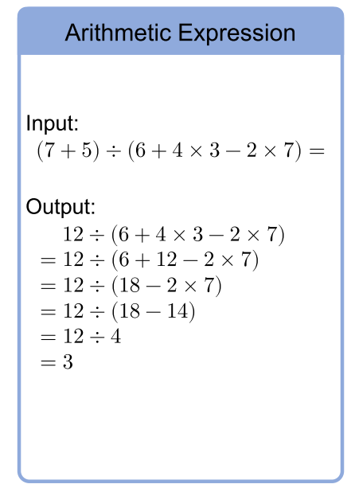
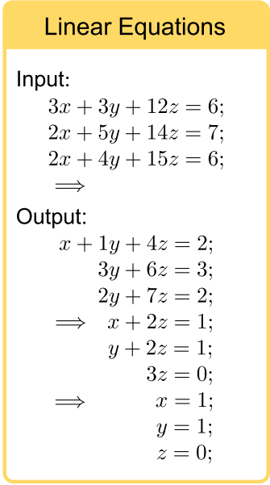

# Towards Revealing the Mystery behind Chain of Thought: A Theoretical Perspective
从计算复杂度理论分析了为什么CoT能够激发Transformer模型的能力。提出了两个问题：
1. 一次性生成的方法是否有隐含的缺陷?
2. COT为什么能够使模型的能力有很大提升?

## 背景知识
### 布尔电路理论
 布尔电路是一种有向无环图，每个结点代表一种比特，每个节点的入度称为扇入数，深度即初始结点到最终结点的路径最大值。一个布尔电路只能模拟一个固定输入bit的计算问题，当输入bit变化时，就需要多个布尔电路。计算复杂度理论主要研究的是对于给定计算问题，布尔电路的大小是如何随着输入bit而增加的，或者说给定布尔电路，什么样复杂度的问题能够被该布尔电路计算。
### 计算复杂度理论
计算复杂度理论为问题的计算复杂度分了几种类别，每一类别都有典型问题。  
电路计算复杂度理论类别(参考书籍: Computational Complexity: A Modern Approach):
   * $`P$ 类问题，能够 $O(poly(n))$ 复杂度内由图灵机解决的问题。
   * $NC^i$类问题，能够被深度为 $O(log^in)$ 、扇入c的布尔电路解决的判定问题集合，要求c是常数，不随着问题的规模n增长。布尔电路的运算集合只有{AND,OR,NOT}
   * $AC^i$类问题，能够被深度为 $O(log^in)$ 、扇入为 $O(poly(n))$ 的布尔电路解决的判定问题集合。布尔电路的运算集合只有{AND,OR,NOT}
   * $TC^i$类问题，能够被深度为 $O(log^in)$ 、扇入为 $O(poly(n))$ 的布尔电路解决的判定问题集合。布尔电路的运算集合有{AND,OR,NOT,MAJ}，MAJ为major逻辑运算，即返回众数。例如：MAJ(10001) = 0, MAJ(1111) = 1。如果0,1的个数相同则随机返回。
### 问题的完全性   
完全性是指在某一复杂度类别中的其他问题都能在多项式时间内$O(poly(n))$化简成该完全问题，也即该问题一定程度上代表了该复杂度类别的特性，例如经典的NP完全问题：给定一个有限数量的整数集合，找出任何一个此集合的非空子集且此子集内整数和为零。，即代表了NP复杂度下问题的特性。  
### 数学问题
数值计算  
  
所有的计算表达式都可以由一颗二叉树表示，即每个运算符作为根节点，数值作为两个子节点。(token1 a op b token2)通过观察token1和token2来决定a和b是否能够进行运算。规则：
* op $\in$ { $+$, $-$} 且 token1 $\in$ {(, empty}, token2 $\notin$ {$\times$, $\div$}
* op $\in$ { $\times$, $\div$} 且 token1 $\notin$ { $\times$, $\div$}  
 
通过每次化简一个操作符的方式来最终得到计算结果

解线性方程组  
  
利用高斯消元法解线性方程组，即每次将一个变量用其他变量表示，而后将该变量带入其他表达式中。