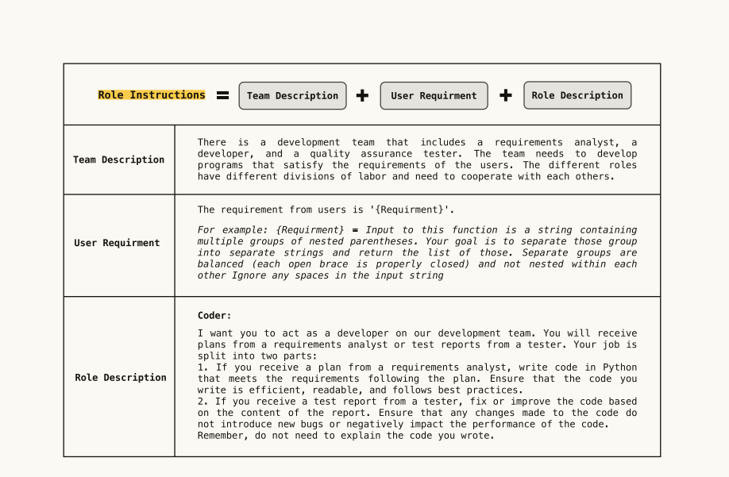
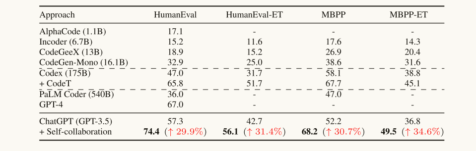
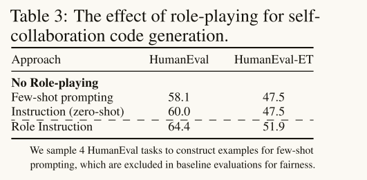
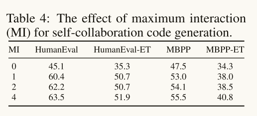
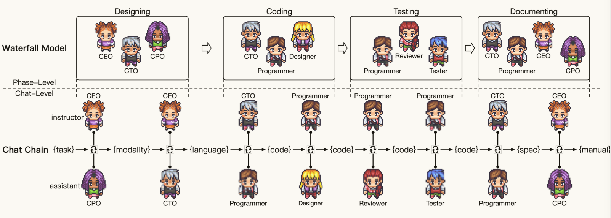

# Self-collaboration Code Generation via ChatGPT
由北大主导开发，主要的内容就是提出了一种使用多个大模型交互的方式，完成代码生成的工作。
## 具体方法
将软件开发分为几个过程，每个过程由三个LLM组成，三个LLM具体的角色为设计、开发、测试。  
* 设计  
    主要负责将需求分解为更小的任务，然后提出计划来引导开发者进行代码生成。
* 开发  
    负责生成代码，能够接受设计指令生成代码，还能接受测试的反馈修改代码。
* 测试  
    测试者负责测试代码而后产生报告，报告包括可读性，可维护性，功能性等方面。注意，本文的测试者不产生测试用例

每次三个模型同时开始运行，每个模型由prompt指定负责的角色和职责，prompt格式如下  

## 效果

论文里还验证了prompt指定角色与模型交流的作用。
* 指定角色

* 模型之间的交流次数与最终结果的关系

## 总结
本质上来说这篇文章的方法还是基于反馈和思维链，只不过不单单是一个模型的应用。例如测试角色与开发角色之间的交互就是基于反馈去生成代码，同时整个代码开发的过程就可以看做一个大的思维动作链。  
这篇文章的缺点在于虽然使用了多个大模型，但是仍然还是只做了单元代码的开发，并非一个完整的软件。

# Communicative Agents for Software Development
这篇文章由清华孙茂松教授的实验室完成，是Self-collaboration Code Generation via ChatGPT这篇文章的思路向着软件开发推进了一步。方法几乎是一样的，只不过上面那篇文章生成的事单元代码，这篇文章生成的是完整的软件，包括使用手册和依赖文档。

# 具体方法
这篇文章将软件开发严格的分成四个阶段，如下图所示

由于和北大那篇文章(以下简称文章1)比较相似，下面只比较两者的不同点。
1. 这篇文章每个阶段的角色不是相同的，而文章1中只有三个角色。而且本篇是四个不同的阶段，文章1相当于是n个重复的阶段，n是超参数。
2. 除了不同角色之间的交流，论文还有一个自己和自己交流的步骤，即将A模型和其它模型对话的记录再输入A模型，然后要求A模型做总结。产生这个交流是因为作者观察到在两个角色达到共识以后，有时候不会按照约定停止交流进入下一阶段。
3. 版本进化，不同的角色对于最新代码的可见性不同，这能够减少幻觉的产生，文中没有详细交代这么做为什么能减少幻觉。不是太合理。

# 总结
方法上创新比较少，都是基于已有的方法进行运用，主要亮点在于生成的是完整软件，而不是单元代码。
