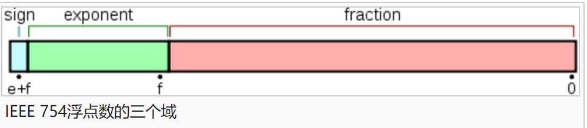
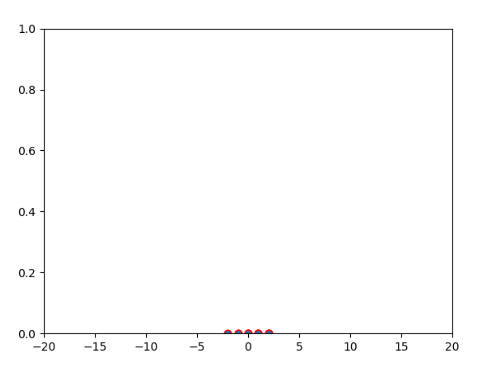
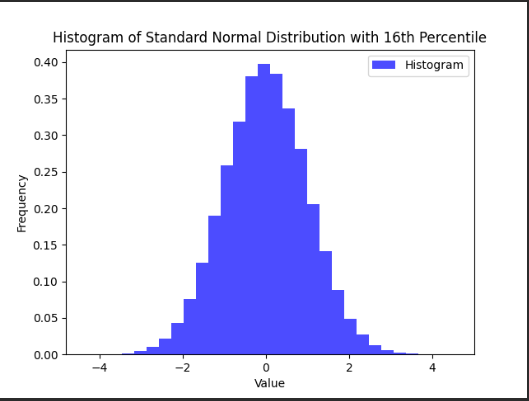
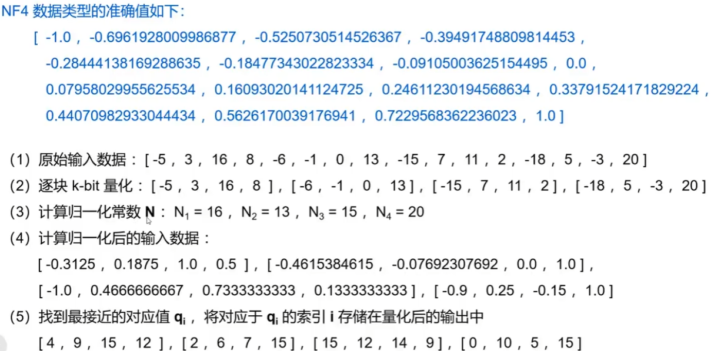

# QLoRA
QLoRA的基本方法来自于两篇重要的文章,一个是LoRA,一个是8-BIT OPTIMIZERS VIA BLOCK-WISE QUANTIZATION。下面首先介绍这两篇文章；
# LoRA微调方法
模型量化多用来用在推理阶段节省显存,将高精度的float类型参数转变成低精度的int类型参数,牺牲一些性能但是节省大量显存。LoRA用在微调训练阶段,冻结原始模型的参数,将更新的矩阵分解为秩较低的矩阵,基于一个理论(Intrinsic Dimensionality Explains the Effectiveness of Language Model Fine-Tuning)：在特定领域任务上,参数矩阵的本征秩是很低的。那么LoRA认为,参数更新的那部分秩可能也很低,那么就可以直接用一个低秩的矩阵作为原参数矩阵的更新值,微调训练时先不断更新这个低秩矩阵,结束后直接加到原来的参数矩阵中。
## 其他微调方法及其缺点
## 低秩分解
$W_i = W_{i-1} + \Delta W$,其中 $\Delta W$ 是模型的经过反向传播计算出的梯度,那么通过对其进行低秩分解,来减少所需的计算量,
$W_i = W_{i-1} + \Delta W=W_{i-1} +  BA$,
$B \in \mathbb{R}^{d \times r}$ ,
$A \in \mathbb{R}^{r \times k}$,
$r \ll min(d, k)$。

# 8-BIT OPTIMIZERS VIA BLOCK-WISE QUANTIZATION
文章首次提出了8bit量化的优化器,之前的工作都是在做模型参数的量化,也即只能在推理阶段使用,训练阶段还是需要fp32的格式。文章的方法主要分为三个内容：非线性量化、分块量化、动态量化。
## 背景知识
### 量化
量化实际上是一种数域的映射,将大集合(通常是值是连续的)中的输入值映射到一个较小集合(多为离散的)中。将真实的数域 $D$映射到 kbit的数上。 $Q^{map}: D \rightarrow [0, 2^k - 1]$,那么每次只需要记录kbit的数就能表示更大范围的数域。
## 非线性量化与线性量化
根据映射函数的是否是线性的分为线性量化与非线性量化。例子：IEEE754浮点数规则就是一种典型的非线性量化表示方法,float使用32bit表示了 $[-3.4e38, +3.4e38]$。 $Q^{map}((2^{30} + 131072)_{10})=Q^{map}(0100	0000	0000	0010	0000	0000	0000	0000)_{2}=(2.03125)_{10}$。原文是 $2^{31} + 131072$,原文的例子是错误的。
> IEEE 754 单精度浮点数规则:
>   
> 第1位为符号位,紧接着的8位为指数,最后23位为尾数,尾数默认是1.xxx
```python
def bin2float(x):
    sign = x >> 31
    # 2**31 - 2**23
    exponent = (x & 2 ** 31 - 2 ** 23) >> 23
    # 2**23 - 1
    tail = bin(x & 8388607).replace("0b", "")
    tail_num = 0

    if len(tail) < 23:
        tail = "0" * (23 - len(tail)) + tail

    for i, num in enumerate(reversed(tail)):
        if num == "1":
            tail_num += 2 ** (i - 23)

    print(((-1) ** sign) * (2 ** (exponent - 127)) * (1 + tail_num))
    result = ((-1) ** sign) * (2 ** (exponent - 127)) * (1 + tail_num)
return result
``` 


## 分位数量化
在理论上是熵损失最小的量化方法,对于输入数据服从的分布 $X$,将 $X$分为 $2^k$ bit个等概率的区域,那么每个区域的中点就可以作为 $Q_i$值,那么整体的数据就能够被均匀的映射在 $2^n$ bit的数上。反例：

  

分位数可以通过对输入数据进行排序,而后找到等分点
分位数点计算方法：

$q_i = \frac{Q_x(\frac{i}{2^k+1}) + Q_x(\frac{i+1}{2^k+1})}{2}$


## 分块量化
分块量化即将数据分为n块,每块单独的进行量化,有独立的量化映射函数 $Q^{map}$。有两个有点：
* 避免Tensor在GPU之间同步
* 有效避免极端值对量化的影响。
## 分位数量化与分块量化的区别
分位数量化解决的问题是 $Q^{map}$如何定义,而分块量化是对输入划分的一种方式。
例子：  
将输入集合 $\{2, 4, 3, 6, 5, 1, 7\}$ 用2bit量化类型表示。  
* 分位数量化：排序后计算4分位数
$\{1, 2, 3, 4, 5, 6, 7\} \rightarrow \{1.75, 3.5, 5.25, 7\}$  
* 分块量化： 分2块,每块单独的进行量化
$\{1, 2, 3, 4\} \{5, 6, 7\}$ ,第一块需要算4分位数,第二块也需要算4分位数
# QLoRA
QLoRA基于前面几个技术结合而来,在其基础上进行改进主要包括三部分：NF4量化类型,双量化,页优化避免内存尖峰
## NF4量化类型
4bit的分块量化加上分位数量化,与之前介绍的技术的区别是计算分位数的方式。最早的分位数量化采用排序算法,将所有输入的数据进行排序,而后找到其分位点,这是假设数据的概率分布是不确定的。现在NF4认为,大多数神经网络的参数都服从均值为0的正态分布,因此直接利用正态分布的累积分布函数找分位数即可,避免了排序计算带了的计算量。  
量化的一般步骤：
* 计算量化常数 $N=max(abs(T_i))$ ,将输入 $T$都归一化的量化数据类型所表示的范围 $Q^{map}$ 
* 对于每个 $T / N$找到 $Q^{map}$中最近的数 $q_i$
* 存储索引 $i$,作为输入 $T$ 的量化输出 $T^Q$  
* 如果需要原值则通过,$T = Q^{map}_i(T^D)N$ ,进行反量化

此外,QLoRA规定所有的输入数据要先进行归一化,即将数据范围归一化到[-1, 1]内。这种量化会产生一个问题,即量化后的数据类型可能没有0值,会导致误差比较大,QLoRA改进了这个方法,使用两部分组成量化后的数据类型,即分别计算[-1 ,0]和[0, -1]区间内量化后的 $q_i$值,负部分为 $2^{k-1}$个 $q_i$,正部分为 $2^{k-1} + 1$。这两部分都会产生0,去掉一个重叠的0,就产生了 $2^k$个 $q_i$值

> tip：4bit可表示16个不同的数,由计算公式可值每两个分位数的中点可以得出一个 $q_i$ 值而 $-\infty$ 和 $+\infty$ 无法参与计算,那么16分位数实际上有15个分位数点,只能够得出14个 $q_i$ 值。因此如果要得到16个 $q_i$ 值,则需要计算18分位数。又因为正负部分要分别计算,负部分需要8个,正部分需要9个,因此需要17个 $q_i$ 值,最后得出需要计算19分位数。  
> 论文中计算后的 $q_i$ 值  
> [-1.0, -0.6961928009986877, -0.5250730514526367,
-0.39491748809814453, -0.28444138169288635, -0.18477343022823334,
-0.09105003625154495, 0.0, 0.07958029955625534, 0.16093020141124725,
0.24611230194568634, 0.33791524171829224, 0.44070982933044434,
0.5626170039176941, 0.7229568362236023, 1.0]

例子：


## 双量化
双量化即将量化的缩放因子 $N_1$ 再进行量化。每64个输入为一个block,每个block都独立的拥有一个量化因子 $N_1$ (本文的 $N$采用每个block中的最大值),因此保存每个输入除了需要4bit索引外,每64个输入还需要保存一个32bit的缩放因子,平均每个输入就是32/64=0.5bit。现在将这个 $N_1$也进行量化,block大小为256,那么 $N_1$ 的缩放因子 $N_2$ 是32bit的,而后每个 $N_1$ 都以8bit索引形式存放,即采用8bit分位数量化(文中规定的8bit,注意区分之前的数据是NF4即4bit的分位数量化),因此,每64个输入的 $N_1$ 现在变成8bit,并且每256(即256个 $N_1$ 为一个block,对比第一次量化是64个输入为一个block)个 $N_1$ (8bit)要保存一个缩放因子 $N_2$ (32bit),那么也就是每 $64 \times 256$ 个输入要保存一个缩放因子 $N_2$ (32bit),每个输入要额外保存的数据为,8/64 + 32/(64*256)=0.127