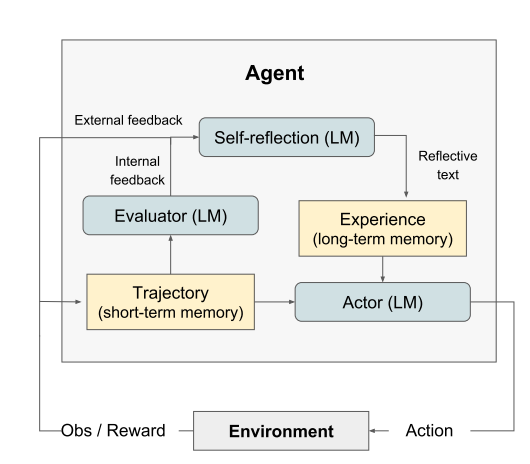
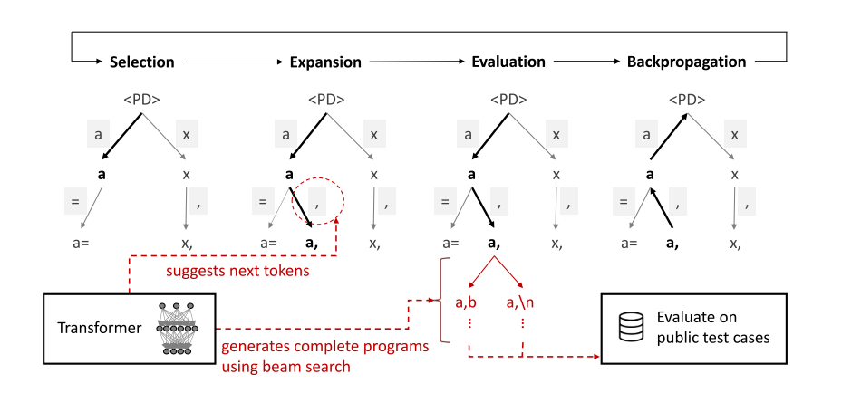

# ReAct
核心是提出了思维与动作协同生成的方法，即让模型生成思路+动作并交替进行。核心是三部分，想法，行动，观察结果。
## 方法
通过instruct和prompt，构建几个简单的例子，使得模型按照想法，行动，观察结果的方式来完成任务。
原文代码如下

```python
webthink_examples = prompt_dict['webthink_simple6']

"""
    prompt过长，建议看源文件.
"""


instruction = """Solve a question answering task with interleaving Thought, Action, Observation steps. Thought can reason about the current situation, and Action can be three types: 
(1) Search[entity], which searches the exact entity on Wikipedia and returns the first paragraph if it exists. If not, it will return some similar entities to search.
(2) Lookup[keyword], which returns the next sentence containing keyword in the current passage.
(3) Finish[answer], which returns the answer and finishes the task.
Here are some examples.
"""

webthink_prompt = instruction + webthink_examples
# 最终模型输入的就是问题，加构建的prompt
prompt += question + "\n"
```
## 相关工作对比
CoT，作者认为CoT仅仅产生了想法，这样容易导致幻觉。最好是想法，行动，结果交替进行。
## 缺点
ReAct容易产生重复的想法和动作，即重复之前的想法及动作，导致推理无法往下进行。 
# Reflexion

主要是用在代码生成方面，核心是也是三部分。
* Actor  
   &emsp;用于生成代码的主体，通常都是大模型，用于完成任务
* Evaluator   
  &emsp;对任务完成情况进行评估，通常也是大模型，这里的评估会生成文本(代码生成就是报错的信息)而不是标量值，这是与传统强化学习最大的区别。
* Self-reflection  
  &emsp;核心创新点，利用大模型自己评估自己的行为，在代码生成任务上是结合评估器找出自己程序的bug，并在下一次生成代码时将，reflextion信息和eval信息一起送进模型中。并且历史生成的reflextion都会保存下来，所有的reflextion一起送进模型。
## 代码实现
作者给的代码和论文中的概念不能完全对应，因此需要仔细看代码。代码中的流程主要由两个组件  
* generator  
  &emsp;负责生成代码和reflextion反馈。原论文中只能调用GPT接口 
* executor  
  &emsp;负责利用python内置的exec模块执行代码，并捕获异常作为反馈。 
# Code Gernaration with MCTS 
核心在于在代码生成过程中，使用蒙特卡洛搜索方法，引导模型生成更高质量的代码。
搜索树的节点分为两类:
  * DecisionNode  
    包括以下几种元素  
    * id,父节点，访问次数等基本信息
    * 状态，已经产生的状态
    * possible_actions与子节点   
      这里的possible_actions由transformer产生，并且使用束搜索算法。
  * ChoiceNode
    包括以下几种元素   
    * 动作及动作的概率
    * 当前动作的价值
     

分为四个阶段：
 * 选择
   > 根据tree_policy(以下简称tp)选择已经生成的节点。tp通常使用上线置信区间算法(UCT)计算最优选择
 * 扩展
   > 扩展阶段通过新建DecisionNode来实现,每次建立dNode节点时都会生成子cNode节点，利用transformer生成，选出topk个概率最大的token作为子节点
 * 评估
   > 同样通过transformer来评估价值，也可以直接把即时奖励(程序通过率)当做价值。
 * 反向传播
    > 根据新节点的价值修改上层节点的价值和访问次数 
## 本质
实际上是加入长期价值Q(s,a)这个信息而产生的效果。因为模型在生成文本的时候，本身就是基于当前已经生成的文本选出一个概率最大的字符作为下一个文本这和MCTS的扩展阶段一样，那么现在MCTS加入了Q(s,a)这个信息，Q表示当前生成这个字符对整个任务的长期影响，而MCTS的过程利用了tree policy根据Q和模型估计的下一个字符的概率(体现在p_ucb算法里面)去计算最应该生成的下一个字符。此外，Q是会根据模拟阶段的结果进行变化的，也就是当前字符同样可以对已经产生的字符有影响，因为根据当前字符模拟而算出的Q值会反馈到上层节点上。上层节点的Q改变后，选择阶段根据p_ucb算法计算的结果就有可能改变。
# 异同点
上述三种方法基于一个假设，即模型已经拥有了足够的认知、推理、学习能力，通过交互反馈能够引导模型完成复杂任务。从而改进当前任务的效果

在任务数据上对模型微调也能够提升效果，但是很多时候微调反而会降低在其他任务上的效果，那么能力与微调之间是什么关系

