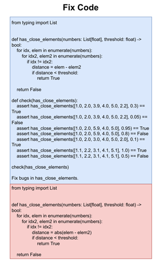
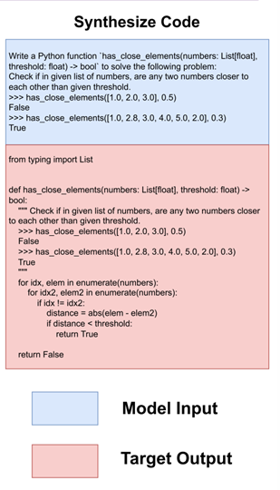

# Evol-Instruction
动机:
1. 人工收集指令太耗时、
2. 人类制定的指令复杂度不好控制，而模型可以实现逐步的增加难度，每一步的指令难度比较好控制

将简单的指令扩展成一个更难的或者更全面的问题(深度，宽度)。
深度方向有五种类型，
* 增加约束
* 将任务更具体化
* 深化(?什么是深化)
* 增加推理步骤
* 需要更复杂的输入
 
宽度就是直接产生一个全新的指令，可能和原来的指令关联性不大

每种进化方向的prompt都不相同，下图为增加约束的prompt

# wizardCoder
利用Evol-Instruct(进化指令) prmopt来训练代码生成的相关任务。
在Evol-Instruction的基础上修改了以下几个类型:
* 去除深化、更复杂的输入、宽度三个进化的方向
* 增加代码调试和代码时空复杂度约束两个进化的方向
* 统一指令进化的prompt格式

prompt格式

question为初始指令，method为进化的方向，通过下面几句话来提示模型

# OctoPack
动机:
1. 当前数据多依赖于已有的模型产生，导致版权问题
2. 当前已有的基准集对于测试模型的能力接近失效(HumanEval榜单上已经有很多模型的分数很高了，没有区分度了)

这篇文章做了一个数据集和一个基准集，基准集是在HumanEval的基础上扩展而来。
## CommitPack数据集
4TB的代码数据，涵盖了350种程序语言，过滤了高质量的代码指令。这个没什么好讲的。
## HumanEvalPack基准集
### 为什么把任务扩展
在实验过程中发现，如果微调过程没有根据代码输入自然语言( $C \rightarrow NL$ )的例子，那么模型的代码解释能力会很差。换句话说，对已有代码的理解能力很差。因此如果要提升模型在代码领域的能力，就要使其"见过"各种代码和自然语言的输入组合，并且使模型产生代码和自然语言。
### 具体的任务
将任务进一步扩展为三类（C代表代码，NL代码自然语言）
1. HumanEvalFix $NL + C \rightarrow C$  
    输入自然语言加有bug的代码令模型输出修正后的代码  
    
2. HumanEvalExplain $C \rightarrow NL$  
    输入代码令模型解释当前代码的作用  
     
3. HumanEvalSynthesize $NL \rightarrow C$  
    输入自然语言令模型输出相应的代码  
    

## 利用数据集训练及用基准集测试的结果

实验结论:
 1. 在starCoder用过滤过得OASST和CommitPACKFT数据集进行指令微调获得了很大的提升。即当前数据集补充了原有数据没有的能力
 2. 在修改bug任务上，需要删除多余代码的bug对于模型来说最难
 3. 模型对于输出长度限制不敏感，没有理解如何给一个合适长度的答案。表现为prompt中限制长度时，模型通常不会按照限制的长度输出。
